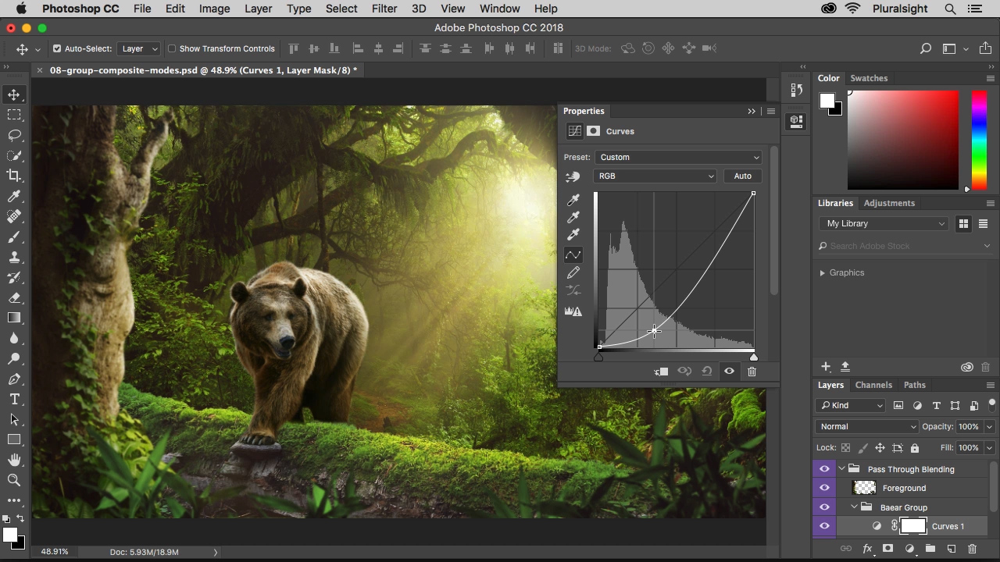
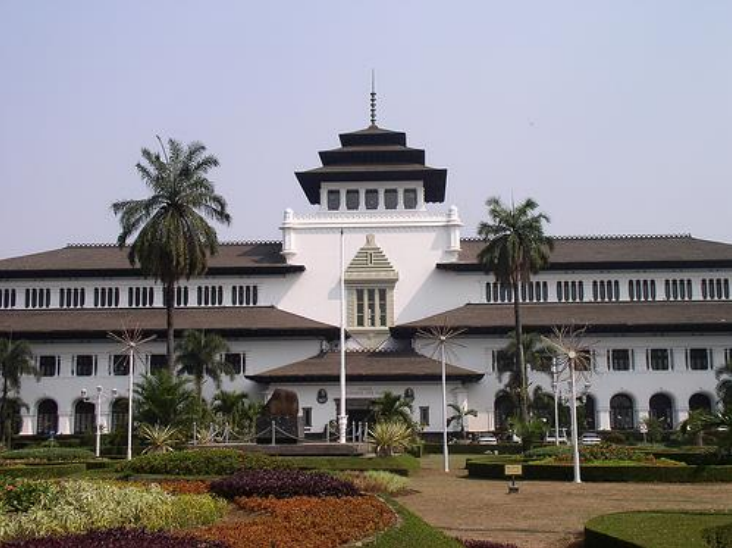
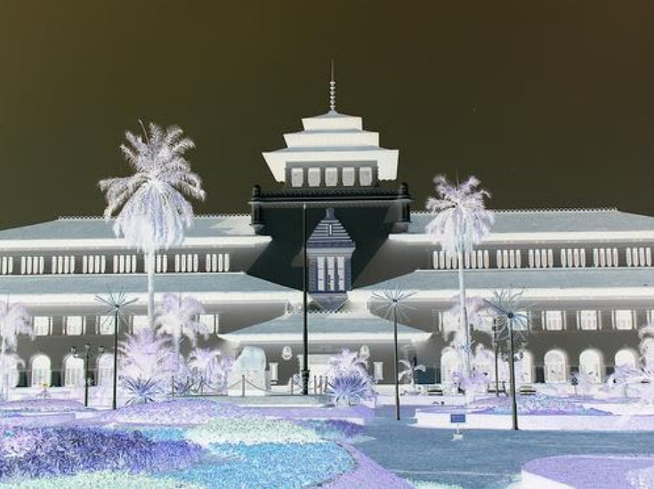
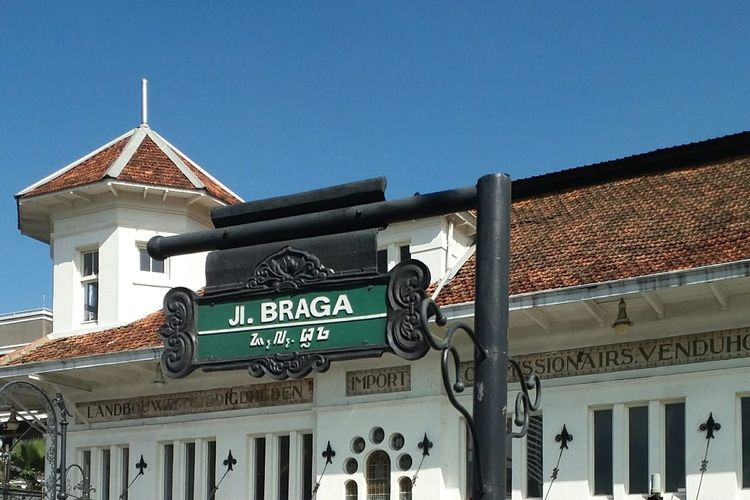
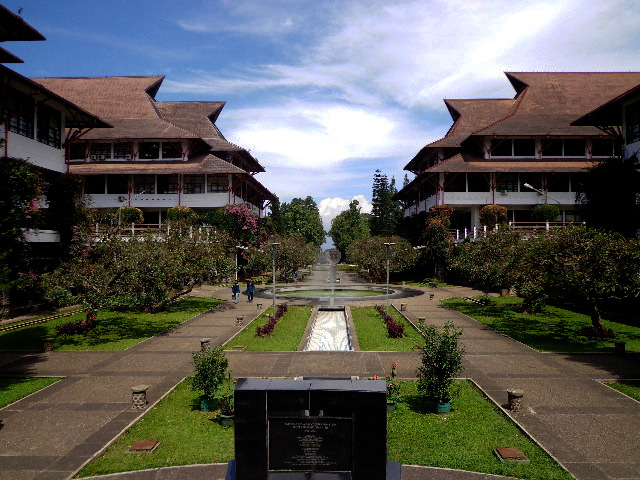
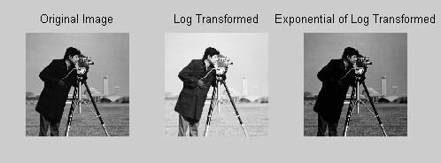
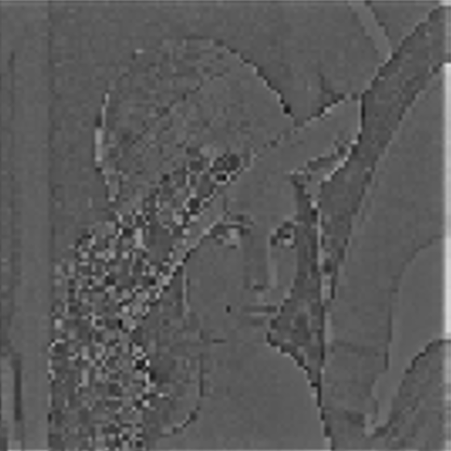
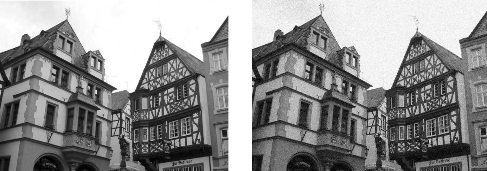

# mini-photoshop

## Latar Belakang
Saat ini, terdapat berbagai macam aplikasi yang dapat digunakan untuk melakukan photo editing. Beberapa contoh aplikasi yang mungkin kamu ketahui adalah Adobe Photoshop, Adobe Lightroom, Picsart, Snapseed, VSCO, dan lain lain. Apakah kamu tahu bahwa beberapa fitur editing yang ada apa aplikasi tersebut dapat dilakukan dengan melakukan pemrosesan matriks seperti yang sudah kamu pelajari pada mata kuliah Aljabar Linier dan Geometri?

## Spesifikasi Wajib
### Umum
1. Aplikasi dibuat dalam bentuk website dan dibebaskan untuk menggunakan bahasa apapun. Framework yang digunakan untuk mengembangkan Frontend dan Backend dibebaskan, namun harus dilakukan pemisahan antara Frontend dengan Backend.
2. Pemrosesan gambar harus dilakukan dalam format matriks, tidak diperbolehkan dalam format gambar.
3. Diperbolehkan menggunakan library eksternal untuk utilitas operasi matriks, operasi matematika, serta backend/frontend, namun algoritma pengolahan citra harus dibuat from scratch.

### Cara Kerja Aplikasi
1. User dapat mengunggah sebuah gambar dan gambar tersebut akan ditampilkan pada layar
2. User dapat memilih berbagai operasi editing yang akan dilakukan pada gambar dari sidebar website. Menu-menu editing tersebut berbentuk icon seperti pada aplikasi Photoshop.
3. Apabila terdapat banyak operasi editing yang dilakukan pada gambar, maka gambar tersebut akan berubah sesuai operasi apa saja yang sudah diberikan
4. User dapat mengunduh hasil editing dari website
5. User dapat melakukan reset terhadap operasi editing yang sudah dilakukan pada gambar sehingga gambar dapat kembali seperti semula (sebelum diedit sama sekali)

## Milestone 1: Menu-menu Dasar (900 poin)

1. Membuat citra negatif

2. Mengubah citra berwarna menjadi citra grayscale

3. Operasi komplemen pada citra

4. Operasi geometri (rotasi, flipping, zooming)
Fitur rotasi, flipping, dan zooming terbatas seperti pada aplikasi image processing biasanya

Ekspektasi fungsionalitas untuk fitur ini adalah berdasarkan icon-icon di bawah ini:
Icon untuk melakukan rotasi:

Icon untuk melakukan flipping:  

Icon untuk melakukan zooming:  

## Milestone 2: Image Enhancement (1400 poin)

1. Image brightening

2. Contrast stretching 

3. Tranformasi log dan transformasi pangkat

## Milestone 3 (1800 poin)
1. Image blurring dengan teknik Gaussian Filter

2. Penajaman citra (image sharpening) dengan Gaussian Highpass Filter

3. Membuat efek noisy/grainy dengan Gaussian noise

## Bonus (500 poin)
Menambahkan fungsionalitas berikut pada website:
- User dapat melakukan undo/redo terhadap operasi editing yang sudah dilakukan.

## Readme (400 poin)
Readme minimal berisi:
- Cara penggunaan program
- Penjelasan singkat mengenai cara kerja setiap fitur.
- Referensi, framework, dan library yang membantu kalian dalam mengerjakan tugas ini beserta alasan penggunaannya.

## Pengerjaan dan Pengumpulan
- Buat repository pada Github kalian masing-masing dan invite rahmahkn dan shafiranaya ke dalam repository tersebut.
- Struktur repository terdiri atas:
  - folder frontend
  - folder backend
  - folder test, yaitu folder yang berisi contoh masukan dan keluaran gambar yang digunakan saat demo. Gambar disimpan dengan format penamaan: <No. Milestone_No. Fitur_Before/After>.
- Repository tersebut juga wajib dilengkapi readme sesuai ketentuan yang telah disebutkan di atas.
- Penilaian Tugas dilakukan dengan melakukan demo secara langsung menggunakan Google Meet dengan terlebih dahulu menghubungi salah satu asisten untuk penjadwalan demo (line: shafr atau rahmakhrs).
- Bila ada pertanyaan, silakan bertanya langsung ke asisten via LINE Group GAPADAT-K agar dapat dicermati oleh seluruh calon asisten.

## Tips
Berikut referensi yang dapat digunakan untuk pembuatan tugas ini

https://informatika.stei.itb.ac.id/~rinaldi.munir/Citra/2021-2022/citra21-22.htm 
